# Security

[](https://github.com/ryayres-fox/Security/actions/workflows/ci.yml)

Security engineering, built as code.

I'm Ryan Ayres. My path into security started in Air Force intelligence — forward-deployed threat
analysis in a combat theatre, where a wrong assessment had consequences — and ran through a
network-security degree, a master's in cybersecurity and an MBA into two decades of building and
defending production systems: state government, payments, manufacturing OT, and regulated SaaS. The
work spans cloud infrastructure security, compliance engineering and AI security.

This repository is where I show *how* I work rather than just assert it: reference implementations,
working tooling, and the home-lab environment I use to test things I can't test anywhere else.

**Everything here is written from public standards and runs against synthetic targets.** Nothing in
this repository is derived from, copied from, or descriptive of any employer's environment.

---

## Start here

Pick the lane that fits why you're here:

- **Evaluating my work** → the [reference architecture](reference-architecture/), the
  [findings normalizer](findings-normalizer/), and the generated
  [control coverage](docs/control-coverage.md).
- **Learning security, any budget** → [stepping stones](docs/stepping-stones.md) (a degree-free
  learning path with at-home labs), [scanning without a commercial platform](docs/without-a-commercial-platform.md),
  and the [home lab](homelab/).
- **Here for the how, not the what** → [the method](docs/silent-failure-patterns.md)
  (*"could this check have failed?"*) and the [threat model](docs/threat-model.md) written for
  non-specialists.
- **Adopting a piece** → [scanner strategy](docs/scanner-strategy.md) and
  [operating the scan flow](docs/operating-the-scan-flow.md).

New to security engineering entirely? Start with [stepping stones](docs/stepping-stones.md) — it's
the map for everything else here.

---

## What's here

| | |
| --- | --- |
| **[`reference-architecture/`](reference-architecture/)** | A FedRAMP Moderate–aligned AWS security foundation as Terraform modules, with controls mapped to NIST SP 800-53 Rev 5 |
| **[`findings-normalizer/`](findings-normalizer/)** | A Python tool that ingests seven scanners and normalizes them into one system of record with stable identity, history, ownership and dedupe |
| **[`ai-security/`](ai-security/)** | Multi-tenant isolation in an embedding store, and a tool-authorization gate with a prompt-injection regression corpus |
| **[`policies/`](policies/)** | Custom Checkov policies, and the tests that prove they load *and* fire |
| **[`semgrep/`](semgrep/)** | Custom SAST rules, with the same load-and-fire proof plus a false-positive gate |
| **[`tools/`](tools/)** | The control-coverage folder and the repo-hygiene gate |
| **[`homelab/`](homelab/)** | A costed, sequenced NSM build — purchase order, reversible deployment, and a pre-purchase maintenance assessment. Written to be adopted |
| **[`docs/`](docs/)** | The written guidance — grouped by purpose in [Documentation](#documentation) below |

### Run it

```bash
pytest findings-normalizer/tests ai-security tools -q   # 210 tests, ~1 second
pytest policies -q                                      # 11 more (needs checkov)
pytest semgrep -q                                       # 16 more (needs semgrep)
python tools/control_coverage.py --check \
  --component .github/controls.yaml                     # every component declares its controls
checkov -d reference-architecture/ --compact            # 0 failed, 10 skipped-with-reason

cd findings-normalizer && pip install -e .
findings-normalize ingest --tool trivy --input samples/trivy.json
findings-normalize report --format html --out report.html
findings-normalize gate --fail-on critical,high         # exits 1
```

---

## The idea

Most compliance evidence is *reconstructed* — someone goes hunting for screenshots the month before
an audit. That's expensive, it's stale the moment it's captured, and it tells you nothing about
whether the control was holding in between.

The alternative is to make the system produce its own evidence continuously:

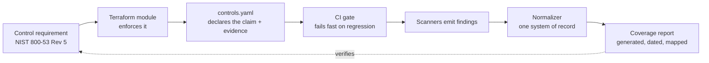

The loop closes. A control isn't "documented," it's *enforced*, and the artifact proving it was
enforced falls out of the pipeline rather than being assembled by hand.

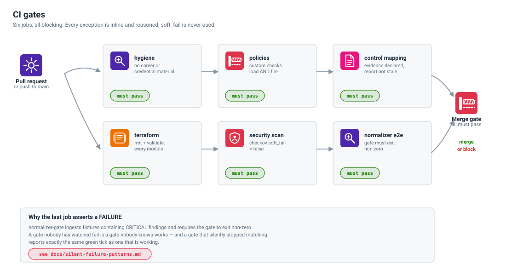

---

## Reference architecture

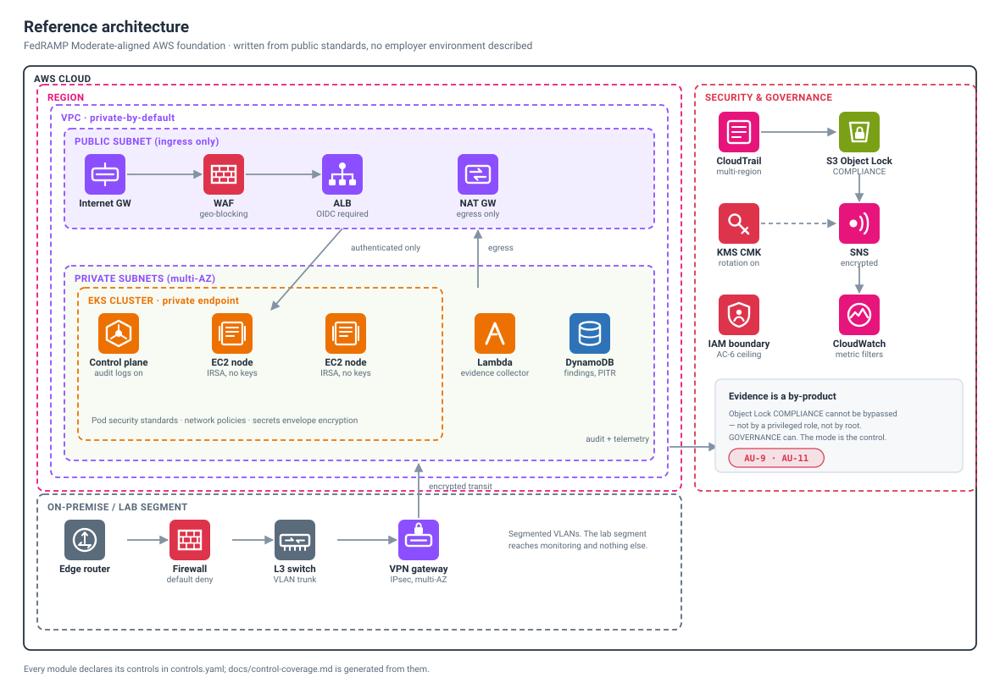

Every diagram here is **generated** by [`tools/render_diagrams.py`](tools/render_diagrams.py) and
diffed in CI. A diagram exported from a drawing tool is a screenshot of what was true the day
someone opened it; the first refactor makes it quietly wrong, in a place nobody thinks to check.
A stale diagram fails the build.

---

## From standard to enforced control

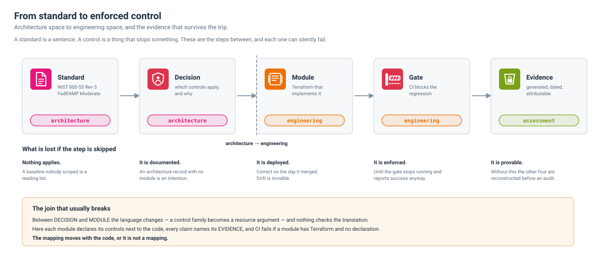

The translation from architecture space to engineering space is where control claims go to die, and
the join that breaks is between **decision** and **module** — a control family becomes a resource
argument, and nothing checks the translation. Here every module declares its controls next to the
code, every claim names its **evidence**, and CI fails if a module has Terraform and no declaration.

---

## Data flow and protection

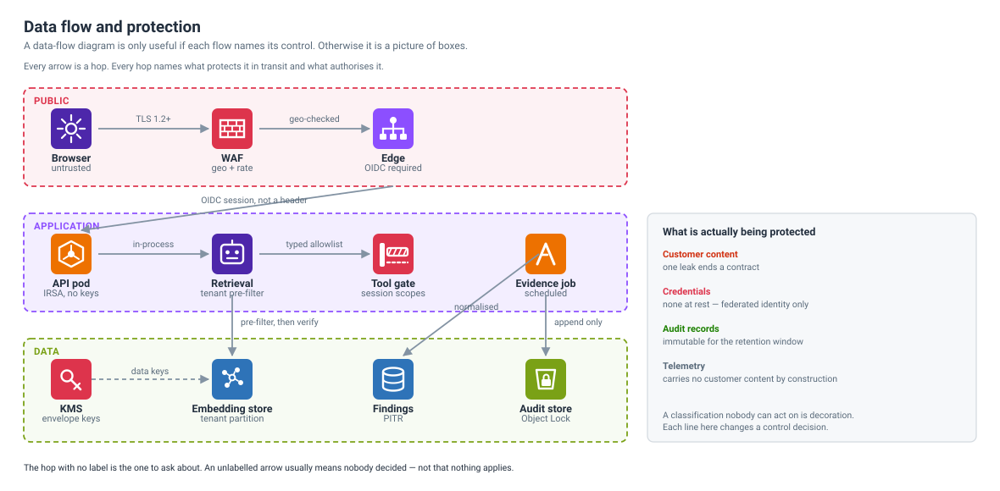

A data-flow diagram is only useful if each flow names its control. The hop with no label is the one
to ask about — an unlabelled arrow usually means nobody decided, not that nothing applies.

---

## Control coverage

Generated by [`tools/control_coverage.py`](tools/control_coverage.py) from each component's
`controls.yaml` — see the full report in [`docs/control-coverage.md`](docs/control-coverage.md).
CI fails if a module has Terraform but no declared controls, if a control has no evidence field, or
if the committed report has drifted from what the code generates. **The CI scanning estate is a
component too** — it declares its controls in [`.github/controls.yaml`](.github/controls.yaml),
held to the same evidence rule.

| 800-53 family | Implemented by | Proven by |
| --- | --- | --- |
| **AC** — Access Control | `iam-baseline` | boundary denies escalation; wildcard subjects rejected at plan time |
| **AU** — Audit & Accountability | `audit-logging` | log-file validation, Object Lock COMPLIANCE, tamper denies in the boundary |
| **IA** — Identification & Authentication | `iam-baseline` | OIDC federation, static-credential creation denied |
| **SC** — System & Comms Protection | `audit-logging` | TLS-only bucket policies, CMK encryption |
| **SI** — System & Information Integrity | `audit-logging`, `findings-normalizer`, `security-pipeline` | SNS notification path; findings gate blocks on critical/high (SI-2) |
| **RA** — Risk Assessment | `security-pipeline` | scanners run every change; canaries assert they were looking (RA-5, RA-5(3)) |
| **SA** — System & Services Acquisition | `security-pipeline` | SAST / secrets / IaC gates block merge; policies under test (SA-11, SA-11(1), SA-15) |
| **CM** — Configuration Management | `security-pipeline` | IaC scanning, `soft_fail=false` (CM-6) |
| **CA** — Assessment, Authorization & Monitoring | `security-pipeline` | durable append-only findings record (CA-7) |

**What this deliberately does not claim:** that any control is *satisfied*. It reports what is
implemented and enforced. Satisfaction is an assessor's judgment involving policy, procedure and
scope that live outside a repository, and conflating the two is how organizations get surprised at
assessment.

---

## Policy exceptions

Ten Checkov checks are skipped across the two modules. Every one of them is skipped **inline, at the
resource, with a written reason** — never with `soft_fail` — and every one is declared in
`controls.yaml` so it appears in the generated coverage report.

That is the practice worth showing. An exception you can read and argue with is a control decision.
An exception you can't see is a gap.

---

## Which scanners, and why

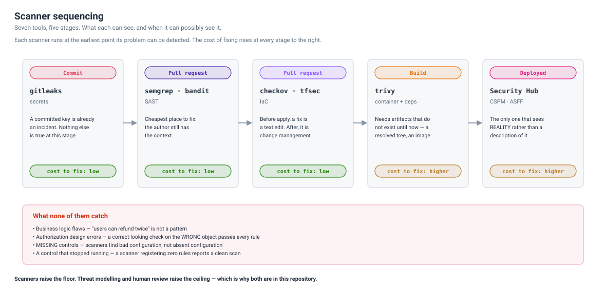

Seven scanners is a lot, and listing them without saying what any of them is *for* is the norm and
useless to anyone deciding what **they** should run.

[`docs/scanner-strategy.md`](docs/scanner-strategy.md) is written for someone who has not done this
before — every term defined on first use, categories before tools. It covers what each scanner
looks at, when in the pipeline it can possibly run, why overlapping tools are deliberate, and the
half that usually goes unwritten: **when not to use each one.**

Two things it insists on:

- **An unactioned scanner is worse than none.** It creates triage debt and a false impression of
  coverage. One tuned scanner beats five untuned ones, because the failure mode of too many is that
  people stop reading any of them.
- **Scanners raise the floor, not the ceiling.** They cannot catch business logic flaws, an
  authorization check that is correct-looking and checks the wrong object, a *missing* control, or
  a control that stopped running. That is why the threat model and the review standard sit beside
  the tooling here.

**No budget for Wiz or Tenable?**
[`docs/without-a-commercial-platform.md`](docs/without-a-commercial-platform.md) maps every
commercial capability to its open-source seat, says plainly where open source *stops* (the
attack-path graph and agentless runtime you don't get), and points to the integrity loop as the one
thing a careful open-source estate has that a green platform dashboard often doesn't.

---

## Findings normalization

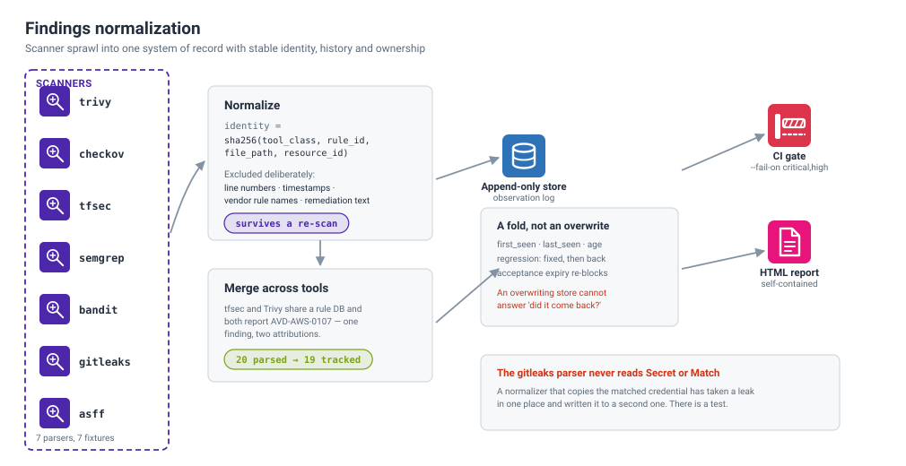

---

## How changes get in

`feature/*` → **develop** → **stage** → **main**. No branch takes a direct push; force-push and
deletion are disabled on all three; eight CI checks are required on every one. The rules live in
[`tools/apply_branch_protection.py`](tools/apply_branch_protection.py) rather than in a settings
page, and `--check` reports drift — because the interesting failure is not "protection was never
configured", it is "protection was configured and then quietly relaxed."

Full model, including two honest limitations of a single-author repository, in
[`docs/branching.md`](docs/branching.md).

---

## Metrics

[`docs/metrics.md`](docs/metrics.md) is generated from the tracked tree, and **every row names its
unit**. "Test functions" and "collected cases" are different numbers; "resource declarations" and
"live instances" are different numbers. A figure that cannot survive *"how did you count that?"*
should not be quoted, and the fastest way to fail that question is to never have decided what was
being counted.

CI diffs the file against a fresh run, so a stale metric fails the build.

---

## AI security

The [`ai-security/`](ai-security/) directory takes a specific position: most published AI-security
guidance is about *making the model behave*, and that is not a control. It fails exactly when it
matters, it fails silently, and every result expires with the next model upgrade.

The controls there assume the model is **already fully compromised** by content it retrieved, and
ask what still holds. What still holds is deterministic code between the model and anything that
matters — a retrieval predicate applied before ranking, and an authorization decision computed from
session state that no prompt can reach.

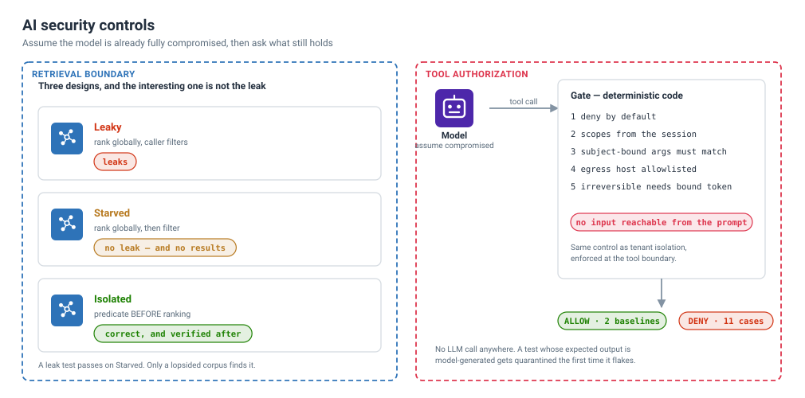

---

## What needs a security review

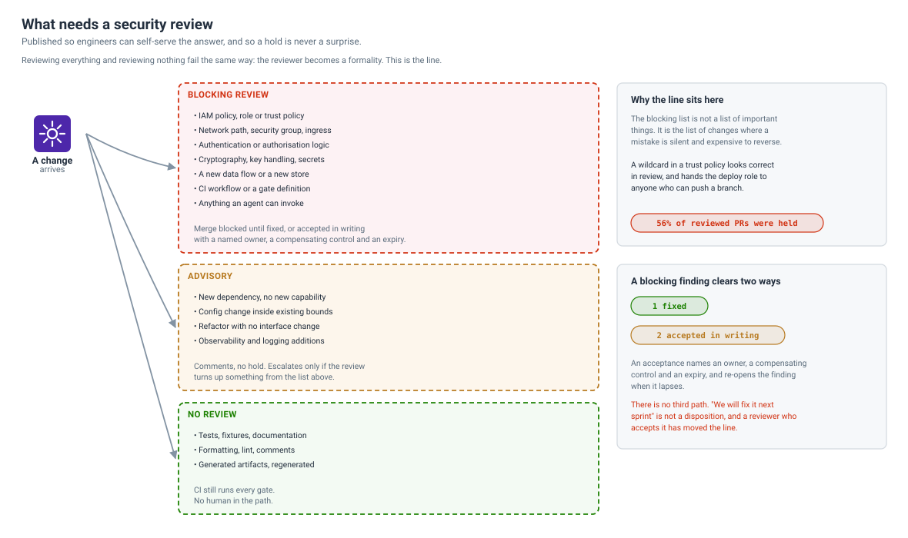

Published so engineers can self-serve the answer, and so a hold is never a surprise. The blocking
list is not a list of important things — it is the list of changes where a mistake is **silent and
expensive to reverse**.

A blocking finding clears exactly two ways: fixed, or accepted in writing with an owner, a
compensating control and an expiry. There is no third path. Full triage in
[`docs/review-standard.md`](docs/review-standard.md).

That's for code changes. For anything you *bring in* — an app, an integration, a vendor — there's a
fill-in intake covering purpose, maintenance, certifications, permissions, data handling, and how
it's secured on their side or ours: [`docs/software-review-template.md`](docs/software-review-template.md).

---

## Threat model

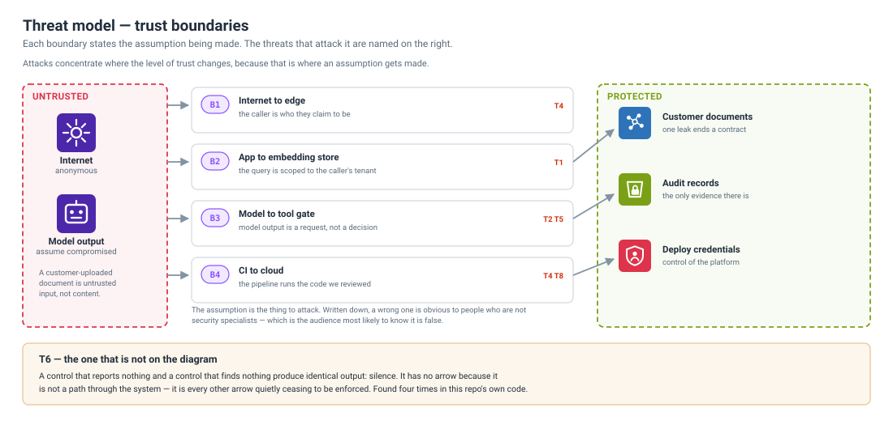

[`docs/threat-model.md`](docs/threat-model.md) is written to be read by people who do not work in
security — because that is the audience that has to fund the work, and most threat models cannot be
read by them.

Three things it does differently, set out as a reusable method in
[`docs/threat-model-method.md`](docs/threat-model-method.md):

- **It leads with the consequence, not the mechanism.** "One customer reads another customer's
  documents", not "IDOR in the retrieval path."
- **Every threat carries the sentence you would have to say publicly if it happened.** That does
  more prioritisation work than any severity scale, and it is self-evident to everyone in the room.
- **It separates "we have a control" from "the control is running."** Almost no threat model does,
  and those two diverge silently — four times in this repository's own code.

Every row ends in a decision state, and the ones marked *needs a decision* are pulled into their own
section with options, costs and a recommendation. A threat model is a request, not a report.

---

## Incident response

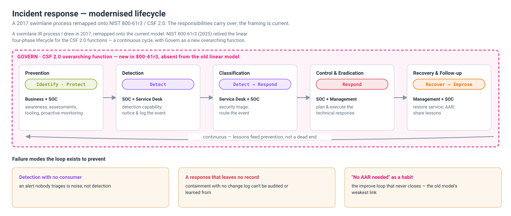

A swimlane IR process I drew in 2017, **remapped onto the current standard**. NIST SP 800-61r3
(2025) retired the linear lifecycle for the CSF 2.0 functions — a continuous cycle with **Govern**
wrapping it — so the interesting part of [`docs/incident-response.md`](docs/incident-response.md) is
*what changed and why*: the responsibilities (the swimlanes) carry over unchanged, the framing is
brought current, and the loop is drawn closing back on itself instead of ending. The write-up shows
the **original swimlane and the remapped version side by side** — both generated, both diffed in CI.
Modernising old work against the current revision is itself the point.

---

## Home lab

Everything above is cloud and enterprise. This is the other half: a network I own end to end, where
I test the things I can't test at work and keep the same rigor on a smaller blast radius.

[`homelab/`](homelab/) is a designed, costed and sequenced NSM build — and it is written to be
**adopted, not admired**. Most home-lab writeups are a parts list and a diagram. This one is a
purchase order with prices, a deployment sequence where every step is reversible, and a
pre-purchase maintenance assessment.

Three ideas in it transfer straight to production work:

- **Buy insight before you buy change.** The first 44% of the budget delivers full traffic
  visibility with *zero* change to how the network routes. Instrument first, change second.
- **Keep the old system as the rollback until the new one has proven itself** — not until it is
  installed.
- **Check the patch cadence before you buy.** That assessment found a device with no coherent
  patch channel, which made it fine as a sensor and disqualifying as the gateway. Maintainability
  decided *where a component was allowed to sit*, not just whether to buy it.

---

## The method

One question produced most of what is in this repository:

> **Could this check have failed?**

Not *what did it report*. A control reporting success is not evidence that it ran, and in every
case worth writing down, the output of a control that was doing nothing was indistinguishable from
the output of a control that was working.

Four worked examples, three of them defects in this repository's own code, are in
[`docs/silent-failure-patterns.md`](docs/silent-failure-patterns.md): a custom policy set that
registered zero checks, a scan gate pinned to a commit that does not exist, an ignore file that the
path in question never consulted, and a guard whose correctness quietly depended on the shape of
the workload rather than on anything it guarded.

The question is reusable, which is the point of stating it as a method rather than as a list of
findings.

## Principles

- **A control that reports clean while enforcing nothing is worse than no control.** Verify the
  enforcement path, not the pass/fail output. [`policies/`](policies/) is the executable form of
  this sentence: it asserts that the policy set *registers*, and that a known-bad fixture actually
  *fails*. Either assertion alone is a fail-open.
- **Name the unit.** "810 resources" means nothing until you say whether that's declarations or live
  instances. Numbers that can't survive "how did you count that?" shouldn't be used.
- **Evidence is a by-product, not a project.** If producing it requires a person, it will be stale.
- **The gate has to be fast or it gets routed around.** Under thirty minutes is a merge gate. Over an
  hour is a nightly job nobody reads.
- **Documentation drift is a defect.** The tests here run the README's own commands, so a doc that
  stops being true fails the build instead of being discovered by whoever clones the repo.

---

## Documentation

Every guide in [`docs/`](docs/), grouped by why you'd open it.

### Learn & adopt (written for others)

- [Stepping stones](docs/stepping-stones.md) — a security learning path, degree-free, with four
  at-home labs and a learner's toolbench
- [Virtual security lab](docs/virtual-lab.md) — an isolated VirtualBox lab (Kali + a vulnerable
  target) to practice against, host-only and snapshot-safe
- [Scanning without a commercial platform](docs/without-a-commercial-platform.md) — open source vs
  Wiz / Tenable, and exactly where it stops
- [Staying current](docs/staying-current.md) — the automated briefing habit; currency as a control
- [Federal HACS study set](docs/federal-hacs/) — cheat sheet, study guide, and flashcards for the GSA HACS oral eval / the U.S. federal compliance stack

### How I work (the practice)

- [Scanner strategy](docs/scanner-strategy.md) — which scanners, the sequence, and when *not* to use each
- [Azure Resource Graph hunting](docs/azure-resource-graph-hunting.md) — finding public IPs, any/any SSH/RDP, Defender misconfig, and drift with free agentless KQL
- [Operating the scan flow](docs/operating-the-scan-flow.md) — authorization, scale, and runner / SLA limits
- [Review standard](docs/review-standard.md) — what code changes need a security review, and how a hold clears
- [Software & vendor review template](docs/software-review-template.md) — a fill-in intake for anything you *bring in* (apps, integrations, vendors)
- [Threat model](docs/threat-model.md) (for non-specialists) and the reusable [method](docs/threat-model-method.md)
- [Writing detections](docs/writing-detections.md) — making a detection a control: a schema, a severity×frequency score, and a validation gate
- [Memory forensics](docs/memory-forensics.md) — reading a machine's live state from a RAM capture: acquire-first, prove the OS, walk processes → network → artifacts
- [Malware triage](docs/malware-triage.md) — detonating a sample in a sandbox without lying to yourself: isolation, routing trade-offs, and blind runs that look clean
- [Incident response](docs/incident-response.md) — a 2017 swimlane process modernised to NIST 800-61r3 / CSF 2.0
- [Silent-failure patterns](docs/silent-failure-patterns.md) — controls that report success while enforcing nothing

### Reference

- [Control mapping](docs/control-mapping.md) → generated [coverage report](docs/control-coverage.md)
- [Metrics](docs/metrics.md) — generated from the tree; every row names its unit
- [Branching](docs/branching.md) — how changes get in
- [Diagrams](docs/diagrams/) — generated SVGs, diffed in CI

---

## Contact

[LinkedIn](https://linkedin.com/in/ryan-ayres) · CISSP · GCIH · M.S. Cybersecurity · M.B.A.
