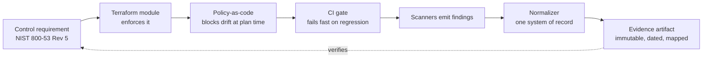
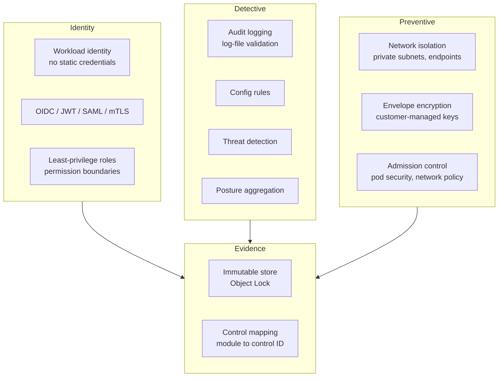

# Security

Security engineering, built as code.

I'm Ryan Ayres — a principal-level security architect working in cloud infrastructure security,
compliance engineering and AI security. This repository is where I show *how* I work rather than
just assert it: reference implementations, working tooling, and the home-lab environment I use to
test things I can't test anywhere else.

**Everything here is written from public standards and runs against synthetic targets.** Nothing in
this repository is derived from, copied from, or descriptive of any employer's environment.

---

## What's here

| | |
|---|---|
| **[`reference-architecture/`](reference-architecture/)** | A FedRAMP Moderate–aligned AWS security foundation expressed as Terraform modules, with controls mapped to NIST SP 800-53 Rev 5 |
| **[`findings-normalizer/`](findings-normalizer/)** | A Python tool that ingests output from many scanners and normalizes it into one system of record with stable identity, ownership and dedupe |
| **[`homelab/`](homelab/)** | My own network — segmentation, detection engineering, and the things I break on purpose |
| **[`docs/`](docs/)** | Architecture, threat models, and the control-mapping strategy |

---

## The idea

Most compliance evidence is *reconstructed* — someone goes hunting for screenshots the month before
an audit. That's expensive, it's stale the moment it's captured, and it tells you nothing about
whether the control was holding in between.

The alternative is to make the system produce its own evidence continuously:

The loop closes. A control isn't "documented," it's *enforced*, and the artifact proving it was
enforced falls out of the pipeline rather than being assembled by hand.

---

## Reference architecture

Each module carries its own README, its own tests, and an explicit statement of which controls it
implements. See [`docs/control-mapping.md`](docs/control-mapping.md).

---

## Control coverage

| 800-53 family | Implemented by | Proven by |
|---|---|---|
| **AU** — Audit & Accountability | `audit-logging` | log-file validation test, retention assertion |
| **AC** — Access Control | `iam-baseline` | policy test: no wildcard actions on write |
| **SC** — System & Communications Protection | `network-isolation`, `kms-encryption` | plan-time policy, encryption-at-rest assertion |
| **CM** — Configuration Management | `policies/`, CI gates | drift detection, fail-fast on regression |
| **SI** — System & Information Integrity | `detective-controls` | scanner integration, finding normalization |
| **RA** — Risk Assessment | `findings-normalizer` | severity model, SLA tracking, ownership |

---

## Home lab

The [`homelab/`](homelab/) directory is the part of this that isn't theoretical. Segmented network,
real detection rules, and deliberately vulnerable targets I use to check whether a detection
actually fires before I'd ever recommend it to anyone.

---

## Principles

- **A control that reports clean while enforcing nothing is worse than no control.** Verify the
  enforcement path, not the pass/fail output.
- **Name the unit.** "810 resources" means nothing until you say whether that's declarations or live
  instances. Numbers that can't survive "how did you count that?" shouldn't be used.
- **Evidence is a by-product, not a project.** If producing it requires a person, it will be stale.
- **The gate has to be fast or it gets routed around.** Under thirty minutes is a merge gate. Over an
  hour is a nightly job nobody reads.

---

## Contact

[LinkedIn](https://linkedin.com/in/ryan-ayres) · CISSP · GCIH · M.S. Cybersecurity · M.B.A.
