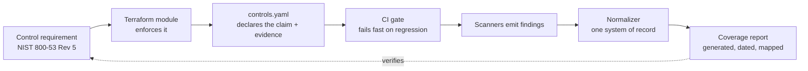

# Security

[](https://github.com/ryayres-fox/Security/actions/workflows/ci.yml)

Security engineering, built as code.

I'm Ryan Ayres — a principal-level security architect working in cloud infrastructure security,
compliance engineering and AI security. This repository is where I show *how* I work rather than
just assert it: reference implementations, working tooling, and the home-lab environment I use to
test things I can't test anywhere else.

**Everything here is written from public standards and runs against synthetic targets.** Nothing in
this repository is derived from, copied from, or descriptive of any employer's environment.

---

## What's here

| | |
|---|---|
| **[`reference-architecture/`](reference-architecture/)** | A FedRAMP Moderate–aligned AWS security foundation as Terraform modules, with controls mapped to NIST SP 800-53 Rev 5 |
| **[`findings-normalizer/`](findings-normalizer/)** | A Python tool that ingests seven scanners and normalizes them into one system of record with stable identity, history, ownership and dedupe |
| **[`ai-security/`](ai-security/)** | Multi-tenant isolation in an embedding store, and a tool-authorization gate with a prompt-injection regression corpus |
| **[`policies/`](policies/)** | Custom Checkov policies, and the tests that prove they load *and* fire |
| **[`tools/`](tools/)** | The control-coverage folder and the repo-hygiene gate |
| **[`homelab/`](homelab/)** | My own network — segmentation, detection engineering, and the things I break on purpose |
| **[`docs/`](docs/)** | [Threat model](docs/threat-model.md) and the [method behind it](docs/threat-model-method.md), [branching](docs/branching.md), [review standard](docs/review-standard.md), control-mapping, generated [coverage](docs/control-coverage.md), [metrics](docs/metrics.md), [diagrams](docs/diagrams/), [silent-failure patterns](docs/silent-failure-patterns.md) |

### Run it

```bash
pytest findings-normalizer/tests ai-security tools -q   # 141 tests, ~1 second
pytest policies -q                                      # 11 more (needs checkov)
python tools/control_coverage.py --check                # every module declares its controls
checkov -d reference-architecture/ --compact            # 0 failed, 10 skipped-with-reason

cd findings-normalizer && pip install -e .
findings-normalize ingest --tool trivy --input samples/trivy.json
findings-normalize report --format html --out report.html
findings-normalize gate --fail-on critical,high         # exits 1
```

---

## Reference architecture


Every diagram here is **generated** by [`tools/render_diagrams.py`](tools/render_diagrams.py) and
diffed in CI. A diagram exported from a drawing tool is a screenshot of what was true the day
someone opened it; the first refactor makes it quietly wrong, in a place nobody thinks to check.
A stale diagram fails the build.

---

## The idea

Most compliance evidence is *reconstructed* — someone goes hunting for screenshots the month before
an audit. That's expensive, it's stale the moment it's captured, and it tells you nothing about
whether the control was holding in between.

The alternative is to make the system produce its own evidence continuously:



The loop closes. A control isn't "documented," it's *enforced*, and the artifact proving it was
enforced falls out of the pipeline rather than being assembled by hand.


---

## Findings normalization


---

## Control coverage

Generated by [`tools/control_coverage.py`](tools/control_coverage.py) from each module's
`controls.yaml` — see the full report in [`docs/control-coverage.md`](docs/control-coverage.md).
CI fails if a module has Terraform but no declared controls, if a control has no evidence field, or
if the committed report has drifted from what the code generates.

| 800-53 family | Implemented by | Proven by |
|---|---|---|
| **AC** — Access Control | `iam-baseline` | boundary denies escalation; wildcard subjects rejected at plan time |
| **AU** — Audit & Accountability | `audit-logging` | log-file validation, Object Lock COMPLIANCE, tamper denies in the boundary |
| **IA** — Identification & Authentication | `iam-baseline` | OIDC federation, static-credential creation denied |
| **SC** — System & Comms Protection | `audit-logging` | TLS-only bucket policies, CMK encryption |
| **SI** — System & Information Integrity | `audit-logging`, `findings-normalizer` | SNS notification path, severity model, SLA and ownership |

**What this deliberately does not claim:** that any control is *satisfied*. It reports what is
implemented and enforced. Satisfaction is an assessor's judgment involving policy, procedure and
scope that live outside a repository, and conflating the two is how organizations get surprised at
assessment.

---

## Policy exceptions

Ten Checkov checks are skipped across the two modules. Every one of them is skipped **inline, at the
resource, with a written reason** — never with `soft_fail` — and every one is declared in
`controls.yaml` so it appears in the generated coverage report.

That is the practice worth showing. An exception you can read and argue with is a control decision.
An exception you can't see is a gap.

---

## AI security

The [`ai-security/`](ai-security/) directory takes a specific position: most published AI-security
guidance is about *making the model behave*, and that is not a control. It fails exactly when it
matters, it fails silently, and every result expires with the next model upgrade.

The controls there assume the model is **already fully compromised** by content it retrieved, and
ask what still holds. What still holds is deterministic code between the model and anything that
matters — a retrieval predicate applied before ranking, and an authorization decision computed from
session state that no prompt can reach.


---

## How changes get in

`feature/*` → **develop** → **stage** → **main**. No branch takes a direct push; force-push and
deletion are disabled on all three; eight CI checks are required on every one. The rules live in
[`tools/apply_branch_protection.py`](tools/apply_branch_protection.py) rather than in a settings
page, and `--check` reports drift — because the interesting failure is not "protection was never
configured", it is "protection was configured and then quietly relaxed."

Full model, including two honest limitations of a single-author repository, in
[`docs/branching.md`](docs/branching.md).

---

## Metrics

[`docs/metrics.md`](docs/metrics.md) is generated from the tracked tree, and **every row names its
unit**. "Test functions" and "collected cases" are different numbers; "resource declarations" and
"live instances" are different numbers. A figure that cannot survive *"how did you count that?"*
should not be quoted, and the fastest way to fail that question is to never have decided what was
being counted.

CI diffs the file against a fresh run, so a stale metric fails the build.

---

## Home lab

The [`homelab/`](homelab/) directory is the part of this that isn't theoretical. Segmented network,
real detection rules, and deliberately vulnerable targets I use to check whether a detection
actually fires before I'd ever recommend it to anyone.

---

## Threat model


[`docs/threat-model.md`](docs/threat-model.md) is written to be read by people who do not work in
security — because that is the audience that has to fund the work, and most threat models cannot be
read by them.

Three things it does differently, set out as a reusable method in
[`docs/threat-model-method.md`](docs/threat-model-method.md):

- **It leads with the consequence, not the mechanism.** "One customer reads another customer's
  documents", not "IDOR in the retrieval path."
- **Every threat carries the sentence you would have to say publicly if it happened.** That does
  more prioritisation work than any severity scale, and it is self-evident to everyone in the room.
- **It separates "we have a control" from "the control is running."** Almost no threat model does,
  and those two diverge silently — four times in this repository's own code.

Every row ends in a decision state, and the ones marked *needs a decision* are pulled into their own
section with options, costs and a recommendation. A threat model is a request, not a report.

---

## The method

One question produced most of what is in this repository:

> **Could this check have failed?**

Not *what did it report*. A control reporting success is not evidence that it ran, and in every
case worth writing down, the output of a control that was doing nothing was indistinguishable from
the output of a control that was working.

Four worked examples, three of them defects in this repository's own code, are in
[`docs/silent-failure-patterns.md`](docs/silent-failure-patterns.md): a custom policy set that
registered zero checks, a scan gate pinned to a commit that does not exist, an ignore file that the
path in question never consulted, and a guard whose correctness quietly depended on the shape of
the workload rather than on anything it guarded.

The question is reusable, which is the point of stating it as a method rather than as a list of
findings.

## Principles

- **A control that reports clean while enforcing nothing is worse than no control.** Verify the
  enforcement path, not the pass/fail output. [`policies/`](policies/) is the executable form of
  this sentence: it asserts that the policy set *registers*, and that a known-bad fixture actually
  *fails*. Either assertion alone is a fail-open.
- **Name the unit.** "810 resources" means nothing until you say whether that's declarations or live
  instances. Numbers that can't survive "how did you count that?" shouldn't be used.
- **Evidence is a by-product, not a project.** If producing it requires a person, it will be stale.
- **The gate has to be fast or it gets routed around.** Under thirty minutes is a merge gate. Over an
  hour is a nightly job nobody reads.
- **Documentation drift is a defect.** The tests here run the README's own commands, so a doc that
  stops being true fails the build instead of being discovered by whoever clones the repo.

---

## Contact

[LinkedIn](https://linkedin.com/in/ryan-ayres) · CISSP · GCIH · M.S. Cybersecurity · M.B.A.
