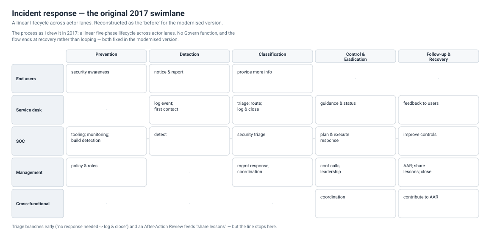

# Incident response — a 2017 process, modernised

I drew this incident-response process as a swimlane diagram during my M.S. in
2017: phases across the top, actor lanes down the side, decisions and hand-offs
between them. The bones held up well enough that it's worth showing — but the
**framing is dated**, and modernising it is a better portfolio artifact than
either the original or a from-scratch rewrite, because the interesting part is
*what changed and why*.

Both diagrams below are generated by
[`tools/render_diagrams.py`](../tools/render_diagrams.py) and diffed in CI, like
every diagram here — including the reconstruction of the original, so the
*before* is a living artifact too, not a screenshot of a drawing tool.

## Before — the original 2017 swimlane

A linear five-phase lifecycle across five actor lanes. The activities and
hand-offs are faithful to what I drew; the visual is reconstructed from code so
it can live in the repo under the same rule as everything else.

## After — remapped to the current standard

Same responsibilities, current framing: the phases map onto the CSF 2.0
functions, Govern wraps the cycle, and the flow closes back on itself.

---

## What the original got right (and kept)

- **Swimlanes, not a single flow.** Incident response is a *responsibility*
  problem before it is a technical one — who acts, and when. The lanes (end
  users, service desk, SOC, management, cross-functional) are the durable part.
- **A triage decision early.** "No response needed → log and close" is where
  most events should end, and drawing it stops every event becoming an incident.
- **An After-Action Review that feeds back.** The AAR → *share lessons* loop was
  ahead of its time — it is exactly what CSF 2.0 now calls **Improve**.

## What was dated (and changed)

The original is a **linear five-phase lifecycle**. That was reasonable in 2017,
but the current authority has moved on:

- **NIST SP 800-61 Revision 3 (2025) retired the linear lifecycle.** It
  reorganised incident response around the **CSF 2.0 functions** —
  *Govern, Identify, Protect, Detect, Respond, Recover* — as a **continuous
  cycle**, not a start-to-finish sequence. A diagram drawn on the old
  preparation → detection → containment → post-incident line is the clearest
  tell that it came from an old PDF.
- **Govern is new, and it wraps everything.** The original had no governance
  function — oversight, roles, policy, and *lessons becoming policy* were
  implicit at best. In the modernised diagram Govern is the band around the whole
  cycle.
- **"Classification" is an ITIL habit, not a NIST phase.** In 800-61 it lives
  inside Detection & Analysis. Kept as a step, remapped as `Detect → Respond`.
- **The cycle closes.** The single biggest change: the last phase feeds the
  first. Lessons feed prevention; the loop is continuous, not a dead end.

### Original phase → current function

| Original phase (2017) | CSF 2.0 / 800-61r3 function |
|---|---|
| Prevention | Identify · Protect (under Govern) |
| Detection | Detect |
| Classification | Detect → Respond (triage) |
| Control & Eradication | Respond |
| Follow-up & Recovery | Recover → Improve |

---

## Who does what (the swimlanes, preserved)

The responsibilities are the reusable core; they carry over unchanged.

| Lane | Prepare (Identify/Protect) | Detect | Triage | Respond | Recover / Improve |
|---|---|---|---|---|---|
| **End users** | security awareness | notice & report the event | provide additional information | — | — |
| **Service desk** | — | log the event; first contact | triage; route; "no response → log & close" | provide guidance & status | feedback & status to users |
| **SOC** | maintain & deploy tooling; proactive monitoring; build detection | detect | security triage | plan & **execute** the technical response | improve systems, controls & practices |
| **Management** | set policy & roles (Govern) | — | management response; cross-functional coordination | conference calls; business-unit leadership | after-action review; **share lessons**; close event |
| **Cross-functional / external** | — | — | — | coordination; conference calls | contribute to the AAR |

---

## Failure modes the loop exists to prevent

The repository's recurring theme — *a control that reports success while doing
nothing* — has incident-response equivalents, and they're the annotations on the
diagram:

- **Detection with no consumer.** An alert nobody triages is noise, not
  detection. (The same "did it fire *and* was anyone looking" split as
  [`silent-failure-patterns.md`](silent-failure-patterns.md).)
- **A response that leaves no record.** Containment with no change log can't be
  audited afterward or learned from — it breaks both Recover and Improve.
- **"No AAR needed" as a habit.** The Improve loop that never closes. The
  original's optional *"close event — no AAR needed"* path is convenient and,
  left unchecked, is how an organisation stops learning. Modern framing makes
  Improve part of the cycle, not an opt-out.

---

*Provenance: remade from a swimlane process I authored in 2017, remapped to NIST
SP 800-61r3 / CSF 2.0. Generic by construction — the lanes are roles, not any
organisation.*
