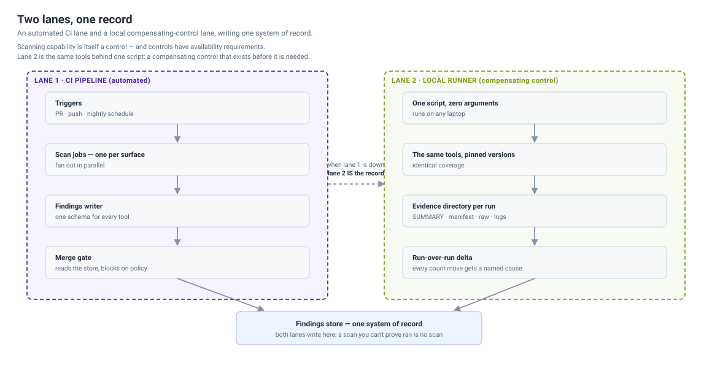

# Operating the scan flow — what to look after

The reference implementation is buildable in a week. Keeping it **trustworthy in
month six** is a different problem, and three things bite — in this order:

1. You need the **authority** to scan before you scan.
2. Scan **volume outgrows** what anyone reads.
3. **Runners and the backend outgrow the SLA.**

Each has a failure mode that looks like success — which is why they belong in the
same repository as the [integrity loop](without-a-commercial-platform.md) and the
[silent-failure patterns](silent-failure-patterns.md).

---

## 1 · Authorization — the right to scan is not automatic

Scanning is an **active operation with blast radius**, not a passive read. Before
the flow is wired, name who authorized it, against what, and with which role.

| Capability | What it actually does | The permission to settle first |
| --- | --- | --- |
| **Cloud posture** (CSPM / prowler-class) | reads across the account or org | a real, auditable, least-privilege **read role** — which is itself a credential to protect |
| **Secret verification** (trufflehog `--only-verified`) | transmits candidate secrets to the **real provider** to test them | authorization + data-handling: that is an outbound call with a live credential inside it |
| **DAST** | hits a **running system** | explicit rules of engagement — which target, which window, what's out of bounds |
| **Runners touching cloud** | assume an identity to scan | OIDC / IRSA, never static keys; the runner is now part of your attack surface |
| **Vendored / partner code** | may be scanned, or may not | some licenses and contracts forbid it — check before you point a scanner at code you don't own |

The line that matters: **DAST or a cloud scan against something you don't own, or
weren't authorized to test, is not testing — it is an incident.** Scanning
capability is a control, and a control needs an owner with the authority to
operate it. Write that down *before* the first run, not after the first
complaint.

---

## 2 · Scan scale gets out of hand

As coverage grows — more repos, more resources, more advisories — three things
balloon, and each fails quietly:

- **Wall-clock.** A full-scope scan that took 4 minutes takes 40, so someone
  quietly moves it to nightly — and now the **PR gate covers less than everyone
  believes it does.**
- **Finding count.** Triage falls behind. A backlog nobody reads is
  indistinguishable from a clean one (see
  [`scanner-strategy.md`](scanner-strategy.md) — *an unactioned scanner is worse
  than none*).
- **Cost.** CVE re-scans on every base-image rebuild, provider API calls, runner
  minutes — all scale with the estate, not with your budget.

**What actually holds the line** (all four are drawn in the CI DAG —
):

- **Scope before you spend.** A change-triage / path-triage job decides what is
  security-relevant *before* any expensive scanner starts.
- **Tier by latency, not coverage.** Fast tools gate the PR; slow tools still run
  and still land in the same store — they just don't hold the developer hostage.
  **Slower is not optional.**
- **Diff / incremental** where the tool supports it: scan the *change* for the PR
  gate, the *world* on a schedule.
- **Cap deliberately, and name the cap.** If you sample, top-N, or skip, say so
  in the run summary.

> **The trap:** every mitigation above reduces coverage to buy speed. That is
> fine — *as long as the reduction is recorded.* An unrecorded scope cut is the
> exact coverage-floor failure the integrity loop exists to catch. A gap named is
> a gap; a gap unnamed is a lie.

---

## 3 · Runners and the backend vs. the SLA

Scanning capability has an **availability requirement** — and the ceiling is
real:

- **Runner concurrency.** A self-hosted pool is finite; queued jobs wait. Past a
  point, PR scans queue *behind* nightly full-scope runs and the PR-gate SLA
  slips.
- **Backend throughput.** The findings store has a write rate and the merge gate
  a read latency. Normalizing and de-duplicating across ~25 tools on a large
  monorepo is not free.
- **The SLA you actually have** is *time from push to gate verdict*. When volume
  outgrows capacity, that number grows **silently** until someone notices a PR
  sat for an hour.

**What to do:**

- **Separate the lanes physically.** Fast PR-gating tier on responsive capacity;
  heavy / slow tier on the nightly schedule or a separate pool — so a 30-minute
  deep-SAST run never blocks a 3-minute PR gate. This is the two-lane split
  () applied to *capacity*, not
  just availability.
- **Autoscale runners with a ceiling**, and treat **queue depth and
  time-to-verdict as first-class SLOs** — measured, alerted, on a dashboard, not
  anecdotes.
- **Backpressure and timeouts.** A scanner that hangs must **fail the job loudly**,
  not stall the queue. Gate on existence *and* invocation, and make every skip a
  checked fact (see [`silent-failure-patterns.md`](silent-failure-patterns.md) —
  *presence checks lie*).
- **The load-shedding rule.** When you cannot keep up, **drop the slow tier and
  say you dropped it** — never silently narrow the PR gate's scope to hit the
  clock. **Missing the SLA visibly is a scheduling problem; hitting it by quietly
  scanning less is a control failure.**

### When you can't scale out — the kiosk runner

You don't always need *more* runners. The value of a freshly-built runner is a
**clean, uncontaminated environment** — no leftover state, no pollution between
scans. You can get that same clean state without building a new one, by running
the runner **kiosk-style**: reset it to a known-good default after every job —
wipe the scan-data directory, restore config to baseline — so each run starts as
pristine as a brand-new box.

It's the cheapest way to hold the clean-state guarantee when you can't scale:

- **No build cost or time.** A reset is seconds; provisioning a fresh node is
  minutes to hours.
- **Less licensing.** Per-node or per-agent licensed tooling costs *per runner*.
  One reset-in-place runner is one licence, not N.
- **Smaller audit surface.** Every new runner is another asset to inventory,
  harden, patch, and evidence. One kiosk runner is one thing to audit — and to
  prove clean, repeatedly.

**The catch is the repo's usual one: verify the reset, don't assume it.** A
kiosk that *reports* it wiped but left state behind produces a "clean" run that
is actually contaminated — the same silent failure everything here is about.
Before a run counts, assert it: the scan-data directory is empty, tool config
matches the baseline checksum, no artifacts survived the last job. A run on a
dirty kiosk is a **RUN VOID**, not a pass (see
[`without-a-commercial-platform.md`](without-a-commercial-platform.md) for the
integrity loop, and [`silent-failure-patterns.md`](silent-failure-patterns.md)).

Cleanest to messiest kiosk: a **fresh container per job** (ephemeral by
construction), a **golden-image snapshot-restore** VM, or a scripted
**wipe-and-restore-defaults**. All trade throughput for cost — a single kiosk
serialises jobs — so pair it with the lane separation above rather than replacing
it.

---

## The thread through all three

Each of these is the same defect in a different hat: **capacity pressure tempts
you to scan less, and the cheapest way to scan less is to do it silently.**

The coverage floor, the honest-skip ledger, and the two-lane fallback are exactly
the controls that make *"we scanned less today"* a **recorded fact** instead of a
green checkmark that means nothing. Operate the flow so that **running out of
capacity fails loud** — because a scan you can't prove ran is indistinguishable
from no scan, and that is as true under load as it is on a laptop.
