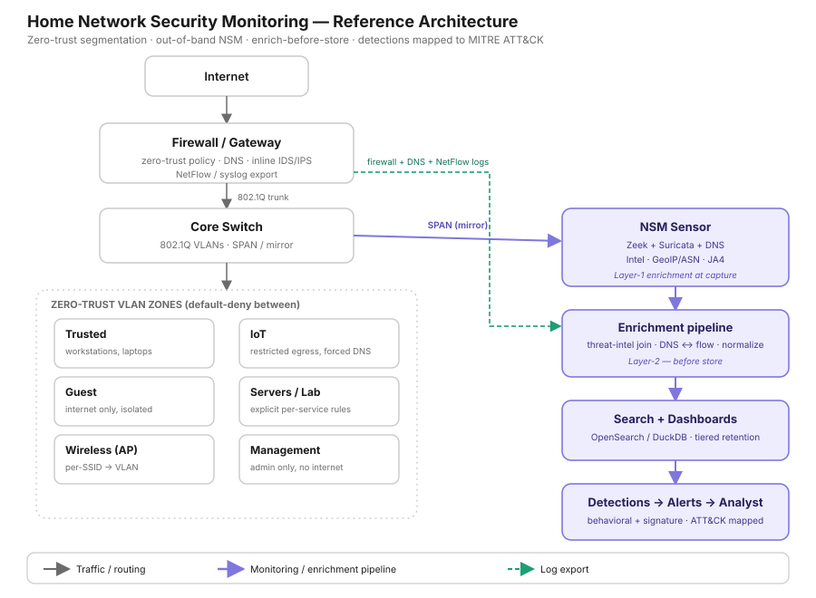

# Home lab — network security monitoring

The part of this repository that isn't a reference implementation. This is a
network I own, built to test detections before recommending them anywhere that
matters.

**Sanitized.** No real addresses, hostnames, credentials or captured data.
Everything here is the design and the detection logic, which is the part worth
reading anyway.

## What it is

A self-built NSM platform for a home and small-office network: segment with a
default-deny posture, tap traffic out of band, enrich it in stream, and run
behavioural and signature detections against it — owning the pipeline end to end
rather than depending on a closed appliance.

**Zeek + Suricata + DNS telemetry → enrichment (GeoIP, ASN, threat intel, JA4)
→ search and dashboards → detections mapped to MITRE ATT&CK.**

| | |
|---|---|
| [`architecture.md`](architecture.md) | Objectives, threat model, design principles, segmentation, and the monitoring pipeline |
| [`detection-engineering.md`](detection-engineering.md) | The detections, how they were tuned, and what they map to |

## Why it is in this repository

Everything else here is written from public standards against synthetic targets,
which is the correct way to build a portfolio under an NDA — and it has a
limitation worth naming: a reference implementation is never wrong, because
nothing runs against it.

This one runs. It has a default-deny that had to be walked back, detections that
fired on nothing useful for a week, and a monitoring path that saw less than the
diagram claimed. That is the point of having it.

## What it demonstrates that the rest of the repository cannot

- **Out-of-band monitoring** — SPAN capture, separation of the data path from the
  analysis path, and what that separation costs in visibility
- **Detection engineering as code** — behavioural analytics for beaconing, DGA,
  exfiltration and rare destinations, tuned against real traffic rather than
  against a fixture
- **In-stream enrichment** — enriching before storage rather than at query time,
  and the retention consequences either way
- **Honest ATT&CK coverage** — what is covered, what is not, and what cannot be
  from a network vantage point alone

## The thing worth asking about

The most useful question here is not what the lab detects. It is **what it did
not detect, and how long that went unnoticed** — which is the same question this
repository asks about every control in
[`docs/silent-failure-patterns.md`](../docs/silent-failure-patterns.md).

A detection that has never fired and a detection that is broken produce the same
dashboard. The lab exists because that is cheap to find out at home and
expensive to find out anywhere else.
