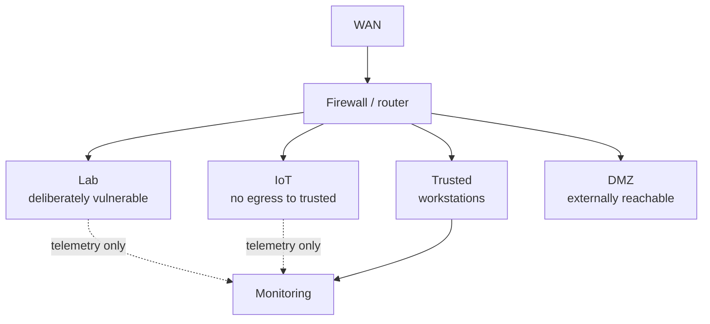

# Home Lab

The part of this repository that isn't theoretical.

A segmented home network I use to test detections, break things deliberately, and try
infrastructure patterns before I'd recommend them anywhere that matters. Work environments are a
bad place to learn what a detection *doesn't* catch.

> **Fill this in as you go.** Each section below is a prompt, not a claim. Delete what doesn't
> apply. Screenshots of dashboards render well here — a Grafana panel showing a detection firing is
> worth several paragraphs.

## Network segmentation

- VLAN layout and the rule that justifies each boundary
- What is allowed to initiate a connection to what, and why
- Where the default-deny sits

## Detection engineering

- Log sources and how they're shipped
- Detection rules written, and — more useful — the ones that **didn't** fire when they should have
- MITRE ATT&CK coverage, honestly assessed: what's covered, what isn't, what can't be

## Deliberately vulnerable targets

- What's running, and which technique each is there to exercise
- The test that proves the detection fires
- Isolation: how the lab segment cannot reach anything that matters

## Things that broke, and what I changed

The most useful section in this file. A running log of failures, root causes, and fixes. Nobody
learns anything from an architecture that always worked.
